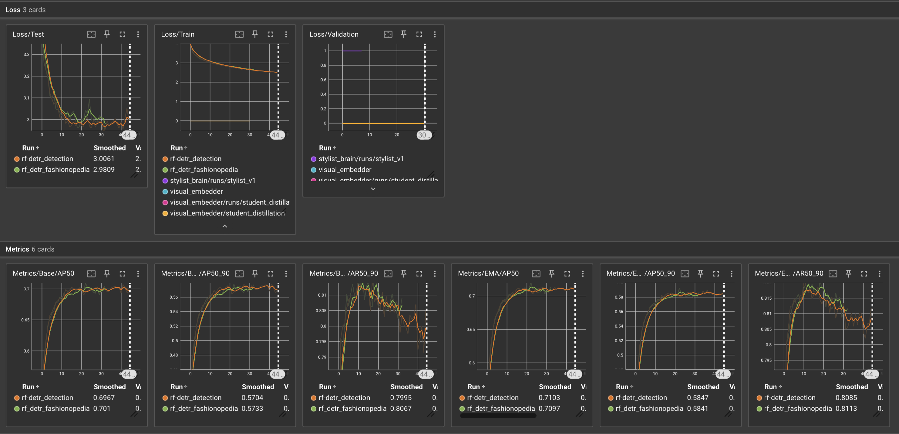
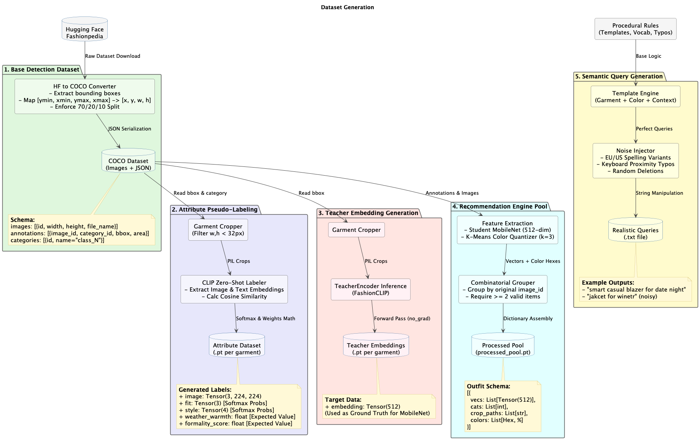

# WardrobeGenie

> **A context-aware fashion recommendation engine powered by computer vision, semantic vector search, and neural outfit ranking.**


WardrobeGenie is an end-to-end machine learning system that transforms a user's wardrobe into a searchable semantic database and generates personalized outfit recommendations from natural language requests.

The system combines:

* **computer vision** for garment detection and attribute extraction
* **vector embeddings** for semantic retrieval
* **neural ranking** for outfit compatibility scoring
* **online preference adaptation** for personalization over time
* **Airflow-based MLOps** for batch ingestion, synthetic data generation, and scheduled retraining

> [!NOTE]
> **Project History:** This repository continues the development of WardrobeGenie. For the earlier Git history and foundational development, refer to the original repository: [Original Repository](https://github.com/QuantumDevGlitcher/WardrobeGenie).

---

## TL;DR

WardrobeGenie lets users upload clothing photos, extracts garments and their attributes, stores visual embeddings in Qdrant, retrieves relevant items from natural language queries, ranks complete outfits, and adapts recommendations based on user feedback.

---

## Features

### Digital Wardrobe

* Automatic garment detection
* Clothing cropping and segmentation
* Multi-attribute prediction
* Dominant color extraction

### Semantic Search

* Natural language outfit queries
* Dense vector embeddings for text and image alignment
* Approximate nearest-neighbor retrieval with Qdrant

### Context-Aware Recommendation

* Weather filtering
* Formality constraints
* Garment-category constraints
* Outfit ranking with a neural model

### Personalization

* Like / Dislike / Skip feedback
* Online preference adaptation
* Dynamic user style representation

### Production Infrastructure

* FastAPI REST API
* Dockerized deployment
* Apache Airflow orchestration
* CI with GitHub Actions

---

## System Architecture

WardrobeGenie separates real-time inference from offline training and data generation.


### Online Serving Stack

The online stack handles low-latency API requests:

* **FastAPI** for request handling and validation
* **Qdrant** for semantic retrieval over garment embeddings
* **Recommendation engine** for candidate filtering and outfit ranking

### Offline Orchestration Stack

The offline stack handles heavier workloads:

* **Apache Airflow** for scheduled batch ingestion
* **Synthetic dataset generation** for training robustness
* **Continuous model training** for periodic updates
* **Model validation and checkpoint management**

---

## Repository Structure

```text
WardrobeGenie-API/
├── .github/
│   └── workflows/
├── dags/
├── data/
│   ├── examples/
│   ├── user_uploads/
│   └── fashion_queries_realworld.txt
├── docs/
│   ├── UML/
│   ├── db_schema.json
│   ├── design.md
│   └── models_training_strategy.md
├── logs/
├── models/
│   ├── attribute_predictor/
│   ├── nlp_query/
│   ├── rf-detr_detection/
│   ├── rf_detr_fashionopedia/
│   ├── stylist_brain/
│   ├── visual_embedder/
│   └── yolos-fashionpedia/
├── public/
│   └── uploads/
├── src/
│   ├── airflow/
│   ├── main/
│   │   ├── perception_layer/
│   │   ├── representation_layer/
│   │   ├── semantic_processing/
│   │   ├── recomendation_engine/
│   │   ├── main.py
│   │   ├── seed_qdrant.py
│   │   └── webserver_config.py
│   └── tests/
├── Dockerfile
├── docker-compose-api.yml
├── docker-compose-airflow.yml
├── requirements.txt
├── LICENSE.md
└── README.md
```

---

## Machine Learning Architecture

WardrobeGenie is organized into five major layers.

### 1. Perception Layer

This layer transforms raw wardrobe photos into structured garment data.

Components include:

* RF-DETR garment detection
* Garment cropping
* Multi-head attribute classification
* Color quantization

Each detected garment can be assigned metadata such as:

* category
* style
* formality
* weather suitability
* dominant colors

### 2. Representation Layer

Each garment is embedded into a dense semantic vector space.

The repository includes:

* visual embedding generation
* student–teacher distillation for lightweight inference
* embedding inference pipelines

### 3. Semantic Processing

Natural language outfit requests are interpreted before retrieval.

Example:

> "Business casual outfit for rainy weather"

The query is converted into:

* a semantic embedding
* intent signals
* contextual filters

### 4. Recommendation Engine

Recommendation happens in three stages:

#### Candidate Retrieval

Qdrant retrieves semantically similar garments using approximate nearest-neighbor search.

#### Context Filtering

Items incompatible with the request are filtered using hard constraints such as:

* weather
* formality
* garment category

#### Neural Outfit Ranking

Remaining garments are assembled into outfit candidates and evaluated jointly using an attention-based ranking model.

### 5. Preference Adaptation

WardrobeGenie adapts to user feedback over time.

Supported feedback:

* 👍 Like
* 👎 Dislike
* ⏭ Skip

User preferences are represented as a continuously updated embedding that shifts toward preferred recommendations and away from disliked ones.

---

## Training & Model Zoo

WardrobeGenie consists of several independently trained models, each optimized for a specific stage of the recommendation pipeline. Every training pipeline follows a reproducible workflow with experiment tracking, model checkpointing, validation, and early stopping.

Training metrics are logged with **TensorBoard**, enabling visualization of model convergence, validation performance, and learning dynamics throughout development.

---

### Model Zoo

| Model                     | Purpose                      | Input                  | Output                                 |
| ------------------------- | ---------------------------- | ---------------------- | -------------------------------------- |
| **RF-DETR**               | Garment detection            | Fashion image          | Bounding boxes & garment classes       |
| **EfficientNet-B0**       | Multi-attribute prediction   | Garment crop (224×224) | Fit, style, weather warmth & formality |
| **MobileNetV3 (Student)** | Visual embedding generation  | Garment crop (224×224) | 512-dimensional embedding              |
| **Distilled BERT**        | Semantic query encoding      | Natural language query | 512-dimensional embedding              |
| **Set Transformer**       | Outfit compatibility ranking | Candidate outfit set   | Compatibility score                    |

---

### Training Workflow

All models follow a common training pipeline:

```text
Dataset
    │
    ▼
DataLoader
    │
    ▼
Model Training
    │
    ▼
Validation
    │
    ├──────────────► TensorBoard Logs
    │
    ├──────────────► Model Checkpoints
    │
    └──────────────► Early Stopping
```

Model checkpoints are stored under the `models/` directory, allowing experiments to be resumed, evaluated, and deployed independently.

---

### Experiment Tracking

TensorBoard is used throughout development to monitor and compare training runs. Logged metrics vary by model but include:

* Training and validation loss
* Classification accuracy
* Detection metrics (where applicable)
* Learning rate schedules
* Early stopping events
* Checkpoint history

Launch TensorBoard locally:

```bash
tensorboard --logdir=models/
```

Then open:

```text
http://localhost:6006
```

<p align="center">
  
</p>

---

### Reproducibility

The training pipeline is designed to support reproducible experimentation through:

* Automated dataset generation and preprocessing
* Versioned model checkpoints
* TensorBoard experiment logging
* Early stopping based on validation performance
* Dockerized training environments
* Apache Airflow orchestration for scheduled retraining

---

## Data Synthesis & Dataset Generation

WardrobeGenie does not rely on a single dataset. Instead, it converts public fashion data into several task-specific datasets for detection, attributes, retrieval, recommendation, and query understanding.

The full workflow is documented in `docs/UML/training.puml` and reflected in the offline preprocessing pipelines.



### Source Dataset

The primary source of visual data is **Fashionpedia**, downloaded from Hugging Face.

Fashionpedia provides:

* high-resolution fashion images
* bounding box annotations
* garment categories
* segmentation annotations

These annotations become the base for all downstream datasets.

### 1. Detection Dataset

The original Fashionpedia annotations are converted into a COCO-style detection dataset for RF-DETR training.

During preprocessing, the pipeline:

* converts bounding boxes into COCO format
* remaps category IDs
* validates annotations
* creates train / validation / test splits

This dataset is used for garment detection.

### 2. Attribute Dataset

Detected garments are cropped into individual images.

Very small crops are discarded to reduce noise.

Each crop is then passed through a CLIP-based pseudo-labeling pipeline that generates probabilistic targets for:

* garment fit
* style
* weather warmth
* formality

These soft labels are stored as PyTorch tensors and used to train the multi-head attribute classifier.

### 3. Embedding Distillation Dataset

To train a lightweight visual encoder for production inference, FashionCLIP is used as a teacher model.

Each garment crop is encoded into a 512-dimensional teacher embedding.

These embeddings serve as supervision for the student encoder used in the production embedding pipeline.

### 4. Recommendation Pool

Each garment is processed into a richer record that includes:

* semantic embedding
* garment category
* dominant colors from K-Means quantization
* crop path

Garments from the same source image are grouped into outfit pools to support candidate outfit generation.

### 5. Synthetic NLP Query Dataset

Natural language fashion queries are created procedurally using templates and vocabulary rules.

The generator combines:

* garment types
* colors
* weather
* occasions
* style descriptors
* seasonal context

It also injects realistic noise such as:

* US / UK spelling variants
* keyboard proximity typos
* omitted characters
* swapped letters
* mobile typing mistakes

Example outputs:

* `smart casual blazer for date night`
* `jakcet for winetr`

These queries are used to train and evaluate the semantic query encoder.

### Why Multiple Datasets?

Each ML task has its own training objective, so WardrobeGenie generates specialized datasets instead of forcing one dataset to do everything.

| Dataset                 | Purpose                                     |
| ----------------------- | ------------------------------------------- |
| COCO Detection          | Garment detection with RF-DETR              |
| Attribute Dataset       | Multi-head garment attribute classification |
| Teacher Embeddings      | Knowledge distillation for visual encoding  |
| Recommendation Pool     | Outfit retrieval and ranking                |
| Synthetic Query Dataset | Natural language query understanding        |

---

## Airflow Pipelines

Apache Airflow orchestrates the offline ML workflows.

### `wardrobegenie_batch_ingestion`

Responsible for ingesting wardrobe uploads at scale.

Typical steps:

* fetch uploads from local storage or S3
* validate idempotency
* run detection and cropping
* extract attributes and embeddings
* insert processed garments into Qdrant

### `wardrobegenie_data_synthesis`

Generates and formats training data.

Typical steps:

* convert Fashionpedia to COCO
* generate attribute pseudo-labels
* create teacher embeddings
* synthesize natural language queries
* build recommendation pools

### `wardrobegenie_continuous_training`

Handles scheduled retraining and deployment.

Typical steps:

* aggregate feedback data
* retrain the stylist model
* validate performance
* update model artifacts in `/models`

---

## Core API Endpoints

### `POST /analyze-outfit`

Accepts raw image uploads and returns:

* bounding boxes
* garment crops
* dominant colors
* predicted semantic attributes

### `POST /recommend/search`

Accepts a text query and user context.

The endpoint:

1. encodes the query into a vector
2. retrieves candidate garments from Qdrant
3. filters candidates using context rules
4. ranks complete outfits
5. returns the best outfit combination

Example:

```json
{
  "query": "Business casual for rainy weather",
  "user_id": "42"
}
```

### `POST /feedback`

Accepts user feedback such as Like / Dislike / Skip and updates personalization state for future recommendations.

---

## Local Development

### 1. Start the API stack

```bash
docker-compose -f docker-compose-api.yml up -d
```

### 2. Seed Qdrant

```bash
pip install -r requirements.txt
python src/main/seed_qdrant.py
```

### 3. Open the API docs

Visit:

```text
http://localhost:8000/docs
```

### 4. Start the Airflow stack

```bash
echo -e "AIRFLOW_UID=$(id -u)" > .env
docker-compose -f docker-compose-airflow.yml up -d
```

### 5. Open the Airflow UI

Visit:

```text
http://localhost:8080
```

Default credentials:

* Username: `airflow`
* Password: `airflow`

---

## Technology Stack

| Layer                  | Technology                       |
| ---------------------- | -------------------------------- |
| API                    | FastAPI                          |
| Deep Learning          | PyTorch                          |
| Vector Database        | Qdrant                           |
| Object Detection       | RF-DETR / YOLO-based experiments |
| NLP                    | Distilled transformer models     |
| Workflow Orchestration | Apache Airflow                   |
| Containerization       | Docker                           |
| CI/CD                  | GitHub Actions                   |

---

## Testing

The repository includes API tests that mock ML components to validate request handling and endpoint behavior without requiring full model execution.

Examples include:

* health checks
* request validation
* recommendation endpoint schema tests

---

## Design Goals

* Low-latency recommendation serving
* Scalable vector retrieval
* Modular ML pipeline design
* Clear separation of online and offline workloads
* Continuous personalization from feedback
* Reproducible training and deployment workflows

---

## Future Work

* Hybrid retrieval combining metadata and vector similarity
* Incremental embedding updates
* Collaborative preference modeling
* Seasonal trend adaptation
* Better outfit explanation generation
* Recommendation caching for faster repeated queries

---

## Project Statistics

| Category | Count |
|----------|------:|
| Machine Learning Models | 5 |
| Airflow DAGs | 3 |
| REST API Endpoints | 3 |
| Docker Compose Stacks | 2 |
| Vector Database | 1 (Qdrant) |
| CI Pipeline | GitHub Actions |
| Experiment Tracking | TensorBoard |

---

## License

This project is licensed under the Creative Commons Attribution-NonCommercial 4.0 International License (CC BY-NC 4.0).

Copyright (c) 2026 Rida Mansour

---

## Acknowledgements

* Fashionpedia
* Hugging Face
* FastAPI
* PyTorch
* Qdrant
* Apache Airflow
